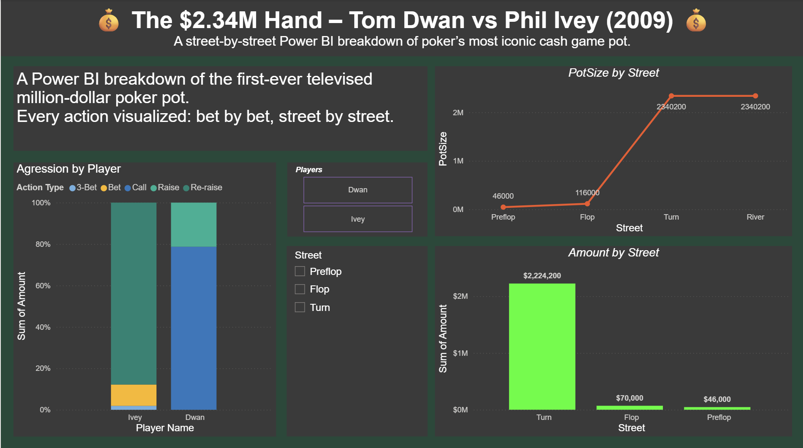

# The $2.34M Hand – Tom Dwan vs Phil Ivey (2009)

A street-by-street Power BI breakdown of poker's most iconic cash game pot: the first-ever televised million-dollar pot, played between Tom Dwan and Phil Ivey on *Full Tilt Million Dollar Cash Game*.

## Dashboard

The report breaks the hand down bet by bet, street by street:

- **Aggression by Player** — stacked bar comparing Ivey and Dwan by action type (3-bet, bet, call, raise, re-raise).
- **PotSize by Street** — line chart tracking the pot growing from $46,000 preflop to $2,340,200 by the turn.
- **Amount by Street** — bar chart of money committed on each street (the turn alone accounts for $2,224,200 of it).
- **Players** and **Street** slicers to filter the whole report down to a single player or street.

## Contents

- `Dwan vs Ivey.pbix` — the Power BI report/dashboard.
- `dashboard-screenshot.png` — a preview of the dashboard, since `.pbix` files don't render on GitHub.
- `data/dwan-ivey-2009.phh` — the hand history for the famous hand itself: the first televised million-dollar pot, from *Full Tilt Million Dollar Cash Game* S4E12 ([video](https://youtu.be/GnxFohpljqM)), in [PHH format](https://arxiv.org/abs/2312.11753). Sourced from the open [phh-dataset](https://github.com/uoftcprg/phh-dataset) project (author: Juho Kim).

## Data

Only the single hand relevant to this project is included (`data/dwan-ivey-2009.phh`). It was extracted from a much larger 1.9GB archive (`poker-hand-histories.zip`) that also bundles unrelated bulk datasets — HandHQ historical online hands, Pluribus AI research hands, and WSOP hands — none of which pertain to this specific matchup, so they were left out. That archive is kept locally, not in this repo.

## Usage

Open `Dwan vs Ivey.pbix` in [Power BI Desktop](https://powerbi.microsoft.com/desktop/) to explore the report.
